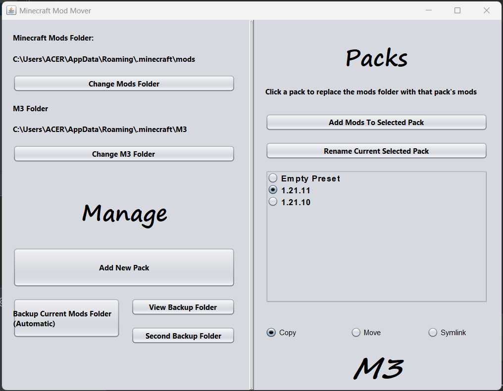

# Minecraft Mods Mover (M3)

**V1.0.0**

A simple Java Swing utility app which assists with moving mod packs (folders) so that
you don't have to yourself.

## Requirements

- Java 21+ (You probably have it installed if you have Minecraft Java Edition)

## Running

If you're on Windows, I've provided an `.exe` file you can simply just run.

Otherwise, you can instead, use the `.jar` file provided in the distribution and run 
the following command in your terminal:

```shell
java -jar m3.jar
```

## App

The app is a single GUI shown as follows:



### Setting Up

> [!WARNING]
> While the app regularly backs up your mods folder to a .zip file in
> 2 different locations, it's still advised you make a copy yourself before
> running the app for the first time.

You first have to click the button to set your
Minecraft `mods` folder. If you're on windows this is usually

```shell
C:\Users\ACER\AppData\Roaming\.minecraft\mods
```

If you had run the app before or would like to set M3's folder to a seprate folder
outside of `.minecraft` you can click the button below that to change
that directory. Although this is rarely needed.

### Adding a pack

> [!NOTE]
> If it's the first time you're running the app, and you already have
> mods within your `mods` folder, you can click the 
> "Set Current Mods As A Pack" (hidden in the screenshot). 
> (Adding a new pack removes this quick option permanently)

Click the "Add New Pack" button to add a pack.

Then if it is not selected within the packs list, select it then
click the "Add Mods To Selected Pack" button, which lets you select
multiple mods to add to the pack. 

Do that multiple times for however many mod packs you have. in the screenshot
i show an example where i have my mods for 1.21.11 and 1.21.10.

Now whenever you select a pack, that pack will be loaded into your `mods`
folder depending on the [movement method](#move-methods) which is
currently being used.

### Move Methods

> [!NOTE]
> When switching between methods or packs, a backup is made and old backups aren't cleared.
> A button is provided to take you straight to where the backups are being stored if
> storage becomes an issue.

These are the 3 options at the bottom labelled "Copy", "Move" and "Symlink"

#### Copy

The default, safest option where all mod files from the pack are simply
copied from `M3/mod-versions/(pack)/` into `.minecraft/mod`

If you wish to add new mods, you have to do it through the app when using `copy`.

#### Move

All mod files are moved from `M3/mod-versions/(pack)/` to `.minecraft/mod`.
This saves space, but if an operation fails halfway, mods can be lost. Be warned.

If you wish to add new mods, you have to do it through the app when using `move`.

#### Symlink

The most efficient and disk-saving method, which creates a symbolic link to
`M3/mod-versions/(pack)/` and places it within `.minecraft`, and renames it to
`mods` such as to mimic the mods folder. This method relies on referencing and if
the actual folder where the mods are stored goes missing this can easily fail quickly.

If you wish to add new mods, you do have to go through the app, however if it's the current
loaded pack you can simply just drop it into the `mods` folder.

> [!NOTE]
> If you're on Windows, you might experience problems with this method. To fix you can either
> try running the app as an administrator or turning on developer mode in your settings.

## Project Info

Honestly, i don't plan on adding more. This is purely convenience for me since my laptop
cannot handle using launchers or clients like any sane user would.

This is a Maven Project.

and yeah, happy crafting!